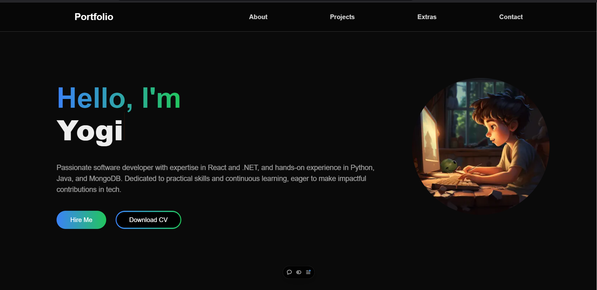

# My Portfolio Next.js App

A modern, dynamic portfolio website built with Next.js 15, showcasing my projects and professional journey.

<div align="center">
  
  
  
  
</div>

## 🌟 Features

- Modern UI design using Next UI and Acertainty UI
- Dynamic content rendering with Next.js 15
- Responsive layout for all devices
- Downloadable resume
- Easy access to contact information and social links
- Project showcase with detailed descriptions
- Dark/Light mode support
- Fast performance and SEO optimized

## 🚀 Getting Started

First, clone the repository and install dependencies:

```bash
git clone https://github.com/YogiJi21/my-portfolio-next-app.git
cd my-portfolio-next-app
npm install
```

Then, run the development server:

```bash
npm run dev
# or
yarn dev
# or
pnpm dev
# or
bun dev
```

Open [http://localhost:3000](http://localhost:3000) with your browser to see the result.

## 🛠️ Built With

- [Next.js 15](https://nextjs.org/) - The React framework for production
- [Next UI](https://nextui.org/) - Beautiful, fast and modern React UI library
- [Acertainty UI](https://acertainty.com/) - For enhanced user experience
- [TypeScript](https://www.typescriptlang.org/) - For type safety
- [Tailwind CSS](https://tailwindcss.com/) - For styling
- [Vercel](https://vercel.com) - For deployment

## 📝 Project Structure

You can start editing the page by modifying `app/page.tsx`. The page auto-updates as you edit the file.

This project uses [`next/font`](https://nextjs.org/docs/app/building-your-application/optimizing/fonts) to automatically optimize and load [Geist](https://vercel.com/font), a custom font designed for Vercel.

## 📚 Learn More

To learn more about Next.js, take a look at the following resources:

- [Next.js Documentation](https://nextjs.org/docs) - learn about Next.js features and API.
- [Learn Next.js](https://nextjs.org/learn) - an interactive Next.js tutorial.
- [Next.js GitHub repository](https://github.com/vercel/next.js) - your feedback and contributions are welcome!

## 🚀 Deployment

This project is deployed on Vercel. You can view it here: [Portfolio Website](https://my-portfolio-next-app-five.vercel.app/)

The easiest way to deploy your Next.js app is to use the [Vercel Platform](https://vercel.com/new?utm_medium=default-template&filter=next.js&utm_source=create-next-app&utm_campaign=create-next-app-readme) from the creators of Next.js.

Check out the [Next.js deployment documentation](https://nextjs.org/docs/app/building-your-application/deploying) for more details.

---

# 👋 About the Developer

<div align="center">
  
</div>

<div align="center">
  <a href="https://linkedin.com/in/yogesh-hingorani21">
    
  </a>
  <a href="https://my-portfolio-next-app-five.vercel.app/">
    
  </a>
  <a href="https://github.com/YogiJi21">
    
  </a>
</div>

<div align="center">
  
</div>

# Hey there! 👋 I'm Yogesh Hingorani

## 👨‍💻 About Me
- 🎓 Currently pursuing MCA from VTU University, Bengaluru (CGPA: 7.5)
- 💻 Post-Graduate Developer specializing in React.js, Next.js, and TypeScript
- 🌟 Strong foundation in Python, Java, C, and C++
- 📍 Based in Gurugram, India
- 📧 Contact: yogi.hingorani21@gmail.com


## 🛠️ Tech Stack

### Languages
<div>
  
  
  
  
  
  
  
  
  
</div>

### Frontend Development
<div>
  
  
  
  
  
  
  
</div>

### Backend & Database
<div>
  
  
  
  
  
</div>

## 📊 GitHub Stats

<div align="center">
  
  <br/>
  
  <br/>
  
</div>

## 🎓 Certifications
- Full Stack Course (Johns Hopkins University, Coursera) - 2024
- Web Development Internship (Embrizon Technologies) - 2024
- Android O & Java Development Bootcamp - 2020
- Ethical Hacking Workshop - 2019

## 📫 Let's Connect!
- LinkedIn: [Yogesh Hingorani](https://linkedin.com/in/yogesh-hingorani21)
- Portfolio: [my-portfolio-next-app-five.vercel.app](https://my-portfolio-next-app-five.vercel.app/)
- Email: yogi.hingorani21@gmail.com

---

<div align="center">
  <i>⭐️ From [YogiJi21](https://github.com/YogiJi21)</i>
</div>
